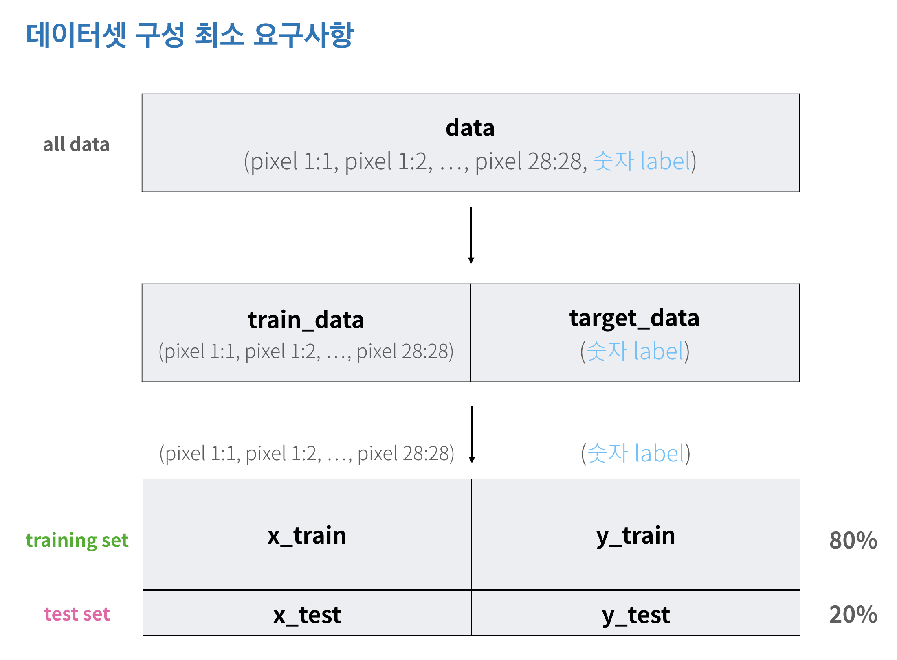
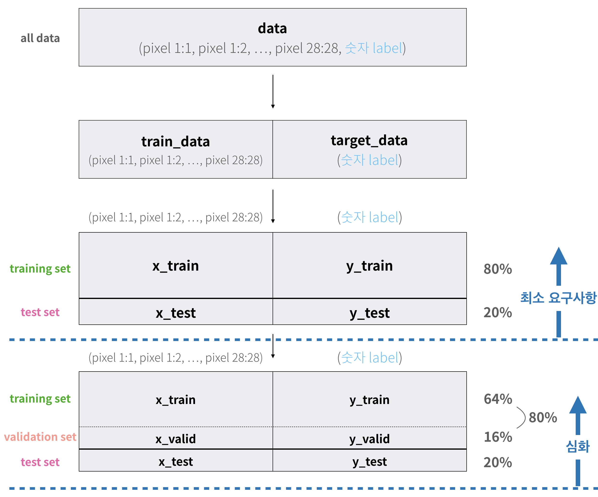
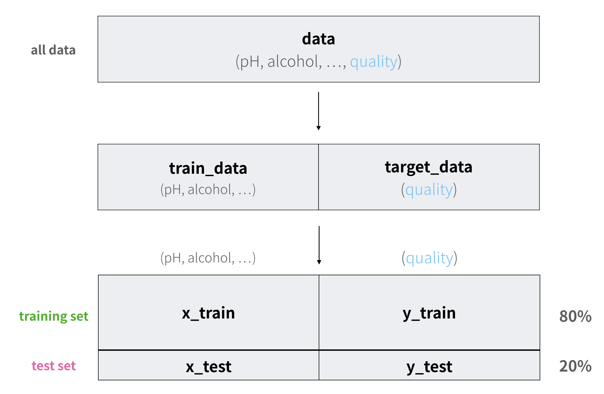
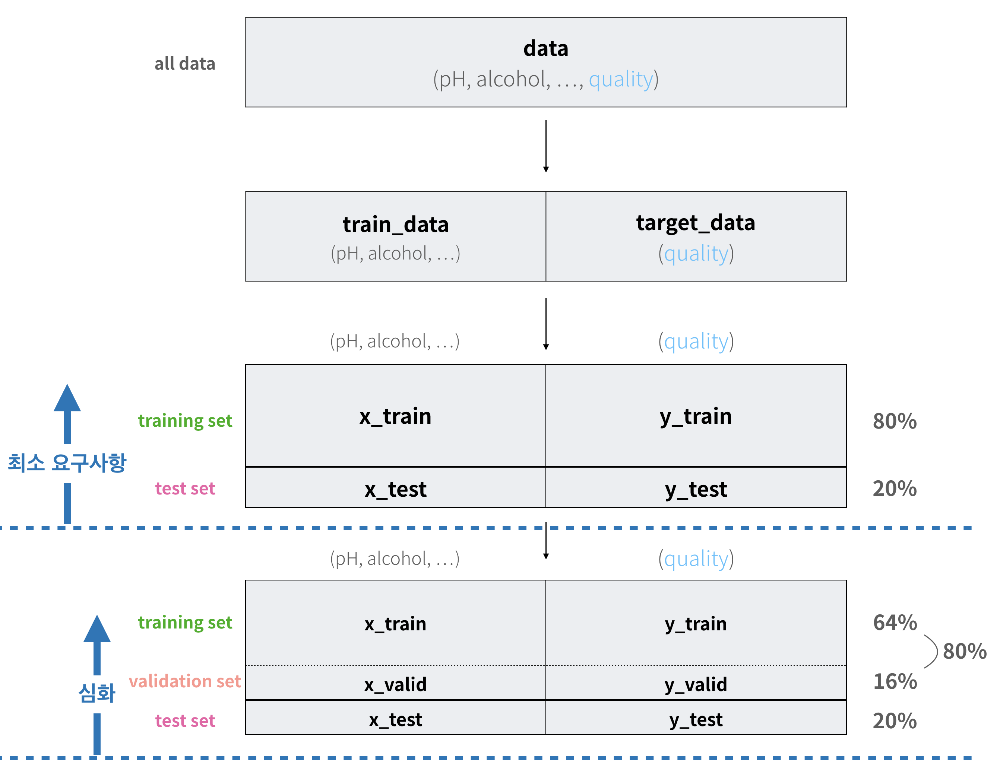

# Stage3 - 모델 수립

## 데이터셋 구성

### 숫자 손글씨 인식하기

training set과 test set을 8:2 비율로 나눕니다.

#### 심화 - validation set 나누기

train set과 test set 외에 validation set을 마련하면 모델 검증, 개발이 용이해집니다.

### 와인 품질 측정하기

training set과 test set을 8:2 비율로 나눕니다.

#### 심화 - validation set 나누기

train set과 test set 외에 validation set을 마련하면 모델 검증, 개발이 용이해집니다.

## 모델링

### 숫자 손글씨 인식하기

1. **분류** **문제인지** **회귀** **문제인지** **구분합니다.**  이 문제는 **분류** **문제**입니다.  분석의 결과로 총 10가지 카테고리\(0, 1, 2, 3, 4, 5, 6, 7, 8, 9 숫자\)가 예측되는 분류\(Classification\) 문제입니다.
2. **분류에** **효과적인** **모델을** **찾아봅니다.**  타이타닉 문제, 아이리스 문제가 바로 분류 문제였습니다.  우리는 위 상황에서 DecisionTreeClassifier, RandomForestClassifier 모델을 사용하여 문제를 해결하였습니다.
3. **학습에** **사용할** **모델을** **선택합니다.**  학습시간이 짧으므로 최대한 많은 모델들을 실험해보는게 좋습니다.
4. **학습을** **진행합니다.**

### 와인 품질 측정하기

1. **분류** **문제인지** **회귀** **문제인지** **구분합니다.**  이 문제는 **회귀** **문제**입니다.  분석의 결과로 0부터 10사이의 품질 측정값이 예측되는 회귀\(Regression\) 문제입니다.
2. **회귀에** **효과적인** **모델을** **찾아봅니다.**  집 값 예측 문제가 바로 회귀 문제였습니다.  우리는 위 상황에서 DecisionTreeRegressor, RandomForestRegressor, LinearRegression, Ridge, PolynomialFeatures 모델을 사용하여 문제를 해결하였습니다.
3. **학습에** **사용할** **모델을** **선택합니다.**  학습시간이 짧으므로 최대한 많은 모델들을 실험해보는게 좋습니다.
4. **학습을** **진행합니다.**

