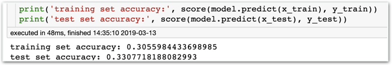
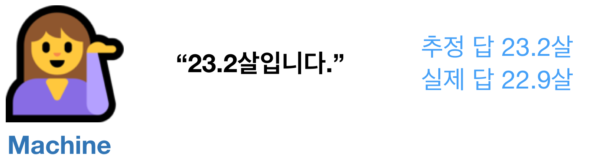
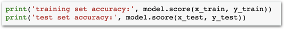
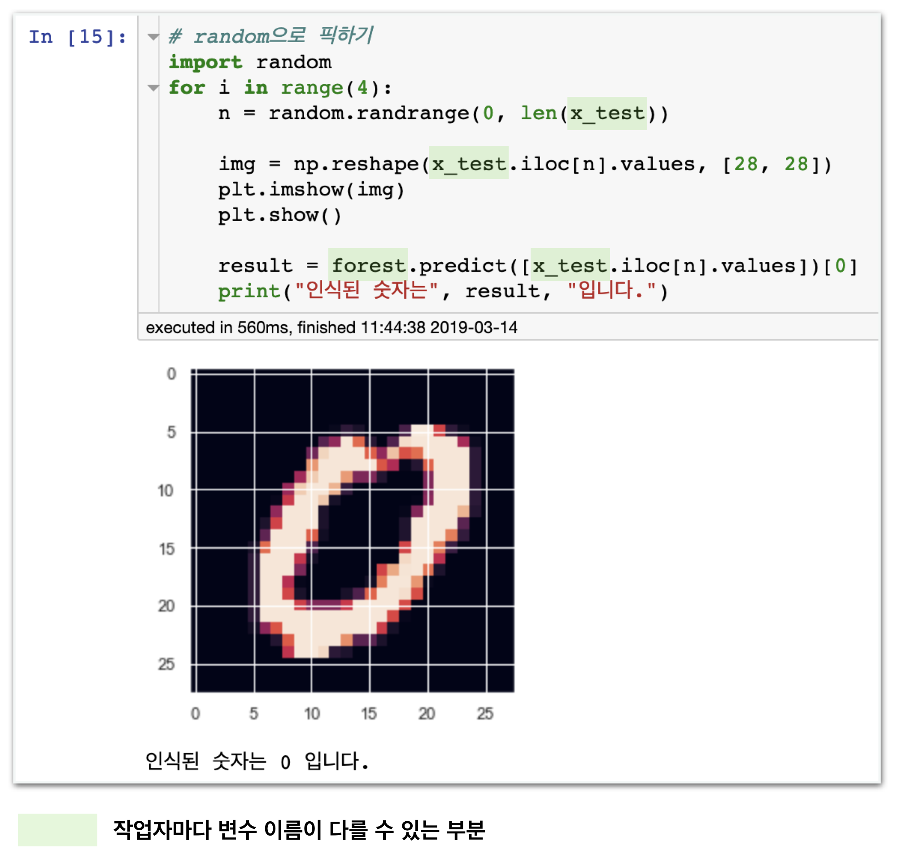
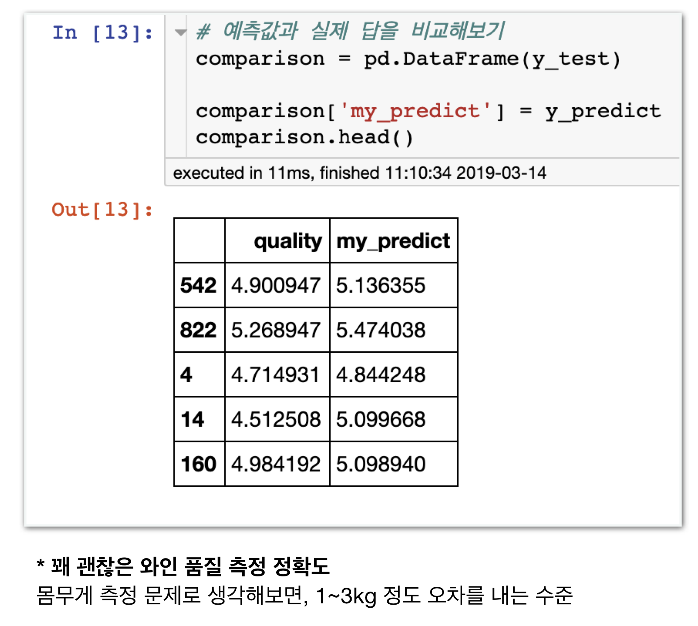
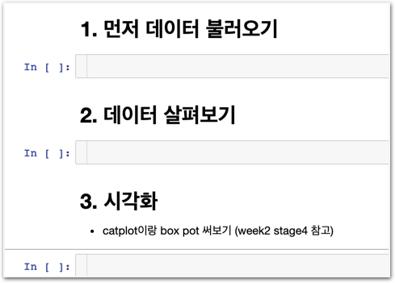

# Stage4 - 모델 검증

## 최종 검증 및 결론 도출

**1. 모델의 score를 구합니다.**

**2. \(validation set이** **있을** **때.** **없으면** **3번으로\)**  
validation set으로 여러가지 모델들의 score를 구해 비교하고  
최고 성능의 모델을 선택합니다.

**3. test set을** **이용하여** **선택한** **모델의** **최종** **성능을** **평가합니다.**

**4. 결론을** **도출합니다.  
숫자 손글씨 인식하기** `000모델을 통해 000의 정확도로 숫자 손글씨를 OCR할 수 있다.`  
**와인 품질 측정하기** `000모델을 통해 000의 정확도로(혹은 다른 평가지표) 와인의 품질을 추정할 수 있다.`

## 검증방안 고민하**기**

### **카테고리화**

**환자A의 신체 나이를 추측하시오.**

이때 예측 결과로,  
"23.2살과 22.9살은 다르니 잘못된 예측입니다."라고 말할 수 있을까요?

**이런 방식으로 정확성을 검증하는게 올바를까요?**

3~4살 정도 차이가 나도 아무런 문제가 없는 상황이라 가정한다면, 위 예측은 올바른 예측입니다. 단순히 숫자 자체가 틀리다고해서 예측에 실패했다고 볼 수는 없는거죠. 우리는 해결하고자 하는 문제 상황마다 다른 검증방법을 도입해야 합니다.

### 우리가 사용하던 기존 방법

scikit learn의 score 기능을 사용하면 상관성을 이용한 결정계수를 자동으로 계산해줍니다.


분류알고리즘\(모델명에 classifier가 들어가는 것\)은 결정계수가 아닌 실제로 매칭 정확도를 표시해줍니다. 회귀모델에서 정확한 값을 매치할 수 없으니 결정계수를 보여주는 것 입니다.


### 대안 - 카테고리화

**22.5~23.5살은 23살 카테고리로 취급**  
`같은 방식으로    
23.5~24.5살은 24살 카테고리    
24.5~25.5살은 25살 카테고리    
25.5~26.5살은 26살 카테고리 …`

반올림, 세대 묶기 등 여러가지 방식으로 카테고리화 할 수 있습니다.

## 결과 확인하기

### 숫자 손글씨 인식하기

### 와인 품질 측정하기

## 초보자를 위한 조언

### 1. 마크다운을 최대한 활용합니다.

바로 코드를 작성하려 하면 쉽지 않습니다.

내가 어떤일을 해야할지 순서대로 마크다운으로 가이드를 작성해주세요. 별거 아닌것 같지만 엄청난 효과가 있습니다. 초보, 고수, 학계 유명인들 모두 중시하고 습관화하는 방법입니다.

### 2. 너무 어렵다면, 두가지 프로젝트 중 한가지는 답을 보고 진행하세요.

감을 잡기 위해 두가지 프로젝트 중 한가지는 먼저 답을 보고 스스로 따라해보세요. 스스로 코드를 보고 따라 치는 것만으로도 큰 도움이 됩니다.



위 링크로 이동하면 **모범답안**을 볼 수 있습니.

한가지 프로젝트를 완료한 후 남은 한가지는 최대한 혼자 힘으로 진행해보세요. 과거에 자신이 만든 코드를 참고하는 일은 아주 좋은 방법입니다.

**최대한 도전하고 모범답안의 도움을 받아 완성해보세요!**

## 분석 가이드와 코딩 시나리오



